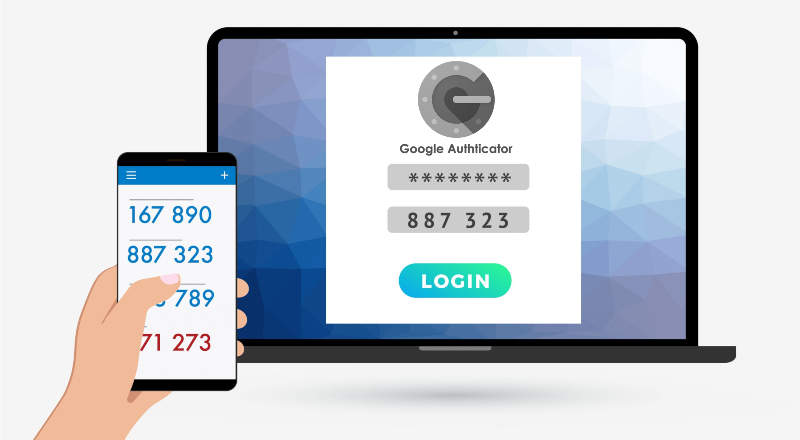

# Python two-factor authenticator API

Simple REST API to generate qr codes for two-step authentication, usable for Microsoft authenticator, Google authenticator and others like it. It also contains a login to control who accesses to generate the qr codes.

<br><br>


<br><br>

## ENDPOINTS
<br>

#### VALIDATE PIN

- This end point receives the user and the pin by parameter, 
checks that they are not empty or null, then we bring the secret
key corresponding to that user from the database,
then we generate the totp object with that secret key and verify the pin
that the user passed us at that moment against the
one that has our object at this moment, 
if they coincide, return True, otherwise, return False, 
if any of the data to check is missing or invalid return Error

<br>

Wait for the following parameters by POST method:

```
user=facu2279

pin=123456
```
Example
```
http://localhost/test/validar_pin?user=facu2279&pin=123456
```
Return
```
True or False or Error
```
<br>


#### GENERATE A NEW USER

- This endpoint receives the user for whom we want to generate a qr,
we check that it is not empty or null,
then we check that that user does not have an active qr,
if it exists in our system we return that it already has a qr in use,
otherwise we generate it one. We generate a random secret key in base32
then we generate the prompt url for the qr,
we save the necessary data, user, secret key, qr, and the current date,
then we save it in the database and return the generated qr for the user scan

<br>

Wait for the following parameters by POST method:

```
user=facu2279
```
Example request
```
http://localhost/test/generar_usuario?user=facu2279
```
Return
```
otpauth://totp/App_Testing:facu2279?secret=QMYRFMCW6APDAQDTOHTFKSFBF37RR2UE&issuer=App_Testing
```

If you generate the qr equivalent to this text it would give you this image:
<br><br>


or Return
```
Error
```

<br>

#### LOGIN

- This endpoint receives user and password by parameter,
we check that they are not empty or null, then we bring
the password that corresponds to that user from the database,
if it matches, return jwt token to check on the frontend that the session is correct
and someone who did not pass the login does not access,
if they do not match or any of the checks are not successful, it returns False

<br>

Wait for the following parameters by POST method:

```
user=facu2279

password=hola123
```
Example request
```
http://localhost/test/login?user=facu2279&password=hola123
```
Return
```
True or False
```
<br>
--------------------------------------------

#### MAKE NEW SYSADMIN

- This endpoint receives by parameter the username
and password of the new system administrator that you want
to create, it is checked that it is not empty or null,
then it is checked that there is not an equal user registered in the database,
if it does not exist, we encrypt the password and save the new user in the database
and then return success, if any of the checks fails or there is a user
with that name, it returns Error


<br>

Wait for the following parameters by POST method:

```
user = facu2279

password = hola123
```
Example request
```
http://localhost/test/generar_admin?user=facu2279&password=hola123
```
Return
```
Success or Error
```
<br>

## Storage

<br>

To create your database I recommend you download [MySQL](https://dev.mysql.com/downloads/installer/) and then run the sql file called sql_basic.sql to use this api with preloaded test data

<br>


<br><br>

## Necessary libraries

It is necessary that you install all these libraries to be able to run this api

- [PyOTP Library](https://pyauth.github.io/pyotp/)
- [Flask](https://flask.palletsprojects.com/en/2.0.x/)
- [Flask-MySQLdb](https://docs.python.org/3/library/datetime.html)
- [Flask-CORS](https://flask-cors.readthedocs.io/en/latest/)
- [PyJWT Documentation](https://pyjwt.readthedocs.io/en/latest/)

## Authors
Made by [Facundo Diaz](https://github.com/facu2279)
- [Linkedin](https://www.linkedin.com/)
